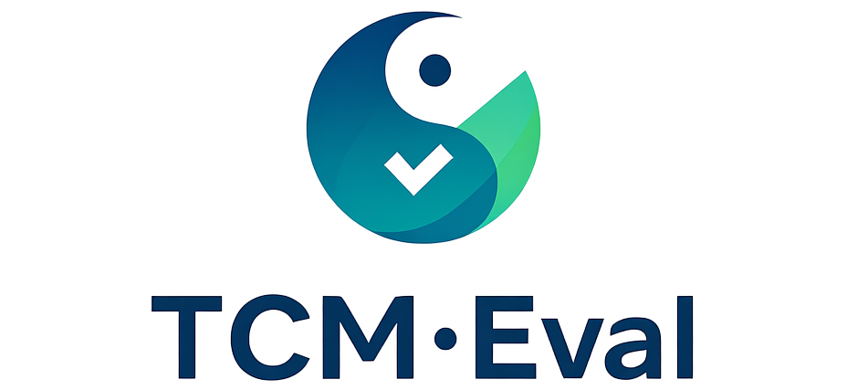

<div align="center">
  
  <br />
  <br />

</div>

## 🛠️ Installation

Below are the steps for quick installation and datasets preparation.

### 💻 Environment Setup

We highly recommend using conda to manage your python environment.

- #### Create your virtual environment

  ```bash
  conda create --name opencompass python=3.10 -y
  conda activate opencompass
  ```
- #### Install OpenCompass from source
  ```bash
    git clone https://anonymous.4open.science/r/TCM-Eval-1512
    cd TCM-Eval
    pip install -e .
  ```

## 🏗️ ️Evaluation

### Your first evaluation!

```bash
# Python scripts
opencompass examples/eval_demo.py
```
You can find more script examples under [examples](./examples) folder.

### API or Local evaluation
```bash
# Python scripts
opencompass examples/eval_TCMeval.py

# You can see TCM-Eval/opencompass/configs/models/TCMmodel to evaluate more models and TCM-Eval/data/TCMbench to see datasets.
```
<p align="right"><a href="#top">🔝Back to top</a></p>

## 📖 Model Support

<table align="center">
  <tbody>
    <tr align="center" valign="bottom">
      <td>
        <b>Open-source Models</b>
      </td>
      <td>
        <b>API Models</b>
      </td>
      <!-- <td>
        <b>Custom Models</b>
      </td> -->
    </tr>
    <tr valign="top">
      <td>

- [ChatGLM2](https://github.com/THUDM/ChatGLM2-6B)
- [ChatGLM3](https://github.com/THUDM/ChatGLM3-6B)
- [Gemma](https://huggingface.co/google/gemma-7b)
- [InternLM](https://github.com/InternLM/InternLM)
- [LLaMA](https://github.com/facebookresearch/llama)
- [LLaMA3](https://github.com/meta-llama/llama3)
- [Qwen](https://github.com/QwenLM/Qwen)
- [TigerBot](https://github.com/TigerResearch/TigerBot)
- [HuaTuoGPT](Ollama)
- [MingYi](https://github.com/alexoyx/mingyi.git)
- [Sunsimiao](https://github.com/X-D-Lab/Sunsimiao.git)
- [ZhongJing](https://github.com/SupritYoung/Zhongjing.git)
- [BianCang](https://github.com/QLU-NLP/BianCang-TCM-LLM.git)

- ……

</td>
<td>

- OpenAI
- Gemini
- Claude
- ZhipuAI(ChatGLM)
- Baichuan
- ByteDance(Doubao)
- WiseDiag(ZZKJ)
- Deepseek
- Baidu(ERNIEBot)
- Xunfei(Spark)
- Qwen

</td>

</tr>
  </tbody>
</table>

<p align="right"><a href="#top">🔝Back to top</a></p>

## 🖊️ Reference

```bibtex
@misc{2023opencompass,
    title={OpenCompass: A Universal Evaluation Platform for Foundation Models},
    author={OpenCompass Contributors},
    howpublished = {\url{https://github.com/open-compass/opencompass}},
    year={2023}
}
```

<p align="right"><a href="#top">🔝Back to top</a></p>
